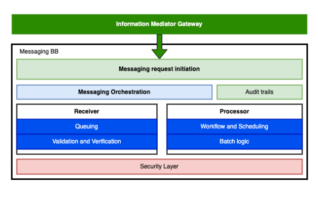
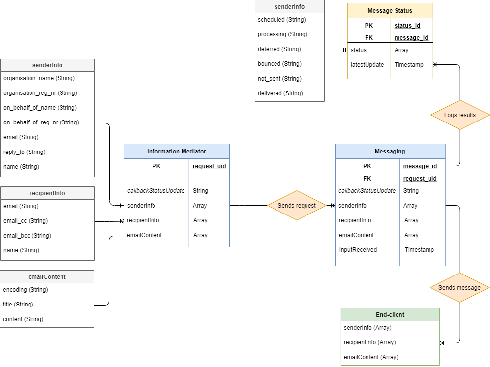
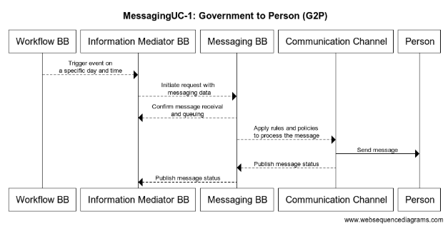
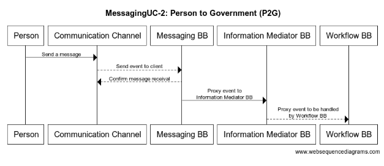

> _This is a markdown version of https://docs.google.com/document/d/1xIu7ws8jlIOeJHExTrZs608HhAbIJurL3Jlmc7AnYWI. Please see original document for complete history, credits, etc._

# GovStack Messaging Building Block

# 1. Description

By utilizing a secure communication protocol, Messaging BB establishes a communication channel between GovStack services and end customers, citizens, in a GovStack implementation.

* For **green-fields development**, it helps developers to build communication components on top of different GovStack services to make use of the federated architecture and passing messages, including machine and human triggered (both synchronous and asynchronous) messages .
* Messaging BB is a standalone messaging gateway/client/proxy (including all possible modalities: email, SMS etc), but can also facilitate connections with **existing messaging service providers, hence** it is making **the adoption process less disruptive** for end users.

This BB can be used for messaging events in many different applications and use cases such as:

* **Example A, encrypted:** after being enrolled into a Health Care Program for the mothers of a newborn child, a woman/caretaker receives a message from the Health Care Service Provider about a doctors' appointment. The message is routed to an existing communication channel/application, in use and provided by the mother. 
* **Example B: unencrypted** - a reminder/notification message from the service provider to the mother about the same appointment. If a doctor decides to hold the consultation remotely, a link is sent to the mother and a video consultation is started (conference is started and users join the room). The event is triggered by the Scheduler component and a new message is processed to the client.
* **Example C:** user-initiated message about a doctor consultation, targeted to a HCP phone number or a chatbot url (universal or targeted messaging back to the system). 

## Terminology

**Definition of the Message**

The message is the main entity of communication in this building block, it holds all the necessary information to deliver the information to the publisher or to the subscriber/client, leaving just a track of delivery logs with no personal data included. Messages follow a predefined protocol and policy for the chosen or predefined communication channel. As a rule, the delivery mode of the message is asynchronous.

**Publisher**

This is the originator of the message, it holds the information about the content of the message and the (meta)data regarding the subscriber who will receive the message. In another words, Messaging BB proxies/relays the message received by a communication channel to the proper subscriber/client/person.

**Subscriber**

In the Publish and Subscribe use case, where publisher is relaying the message into the hands of Messaging BB that will in turn route it to the desired communication channel, the subscriber is the one who is listening to the relevant Message Room to receive the message from a publisher. The subscriber has given the consent to the publisher to access or retrieve and store its data for the purpose of carrying out the messaging event.

**Messaging event**

Messaging event is the (single) act of asynchronous information transfer between the publisher and subscriber, consisting of the following steps: 1) secure identification and access management of the publisher and subscriber; 2) access to and/or retrieval of relevant subscriber data and consent for using the data from the subscriber; 3) selection of relevant data transfer policy and protocol for the messaging event; 4) Management and processing of logs and relevant metadata during and after the messaging event.

**Messaging protocol**

Is the protocol enabling the Messaging BB to communicate and transfer data between the endpoints. 

NB! In its initial versions, GovStack Messaging BB is using [Matrix/Elements ](https://matrix.org/)protocol as a reference point for creating GovStack Messaging BB protocol. 

**Communication channel**

It is the endpoint of message delivery, the means used by the publisher or subscriber to communicate. It can be a social media tool, e-mail or SMS service or a distributed network.

**Log**

It holds the track of message delivery with the encrypted content to help the maintenance and troubleshooting of the messaging services.

**Routing Policy**

Routing policy is the essential, configurable service of the Messaging BB, published in the Information Mediator BB and is enabling the publishers and subscribers to pre-define and use the appropriate routing policy for the particular messaging event. In more advanced implementations, the Routing Policy can be applied for the Messaging Rooms (TBD).  

# 2. Key Digital Functionalities

Messaging building block is a standalone messaging gateway/client/proxy (including all possible modalities: email, SMS, etc), but can also facilitate connections with existing messaging service providers by enabling safe communication. The communication in this building block can be categorized  in two different directions as follows:

* Government to person (G2P):
    * Informing citizens about their registration,
    * Reminding and requesting citizens' confirmation for appointment booking or other events
    * Delivering information on scale to citizens
    * Alerting citizens in emergency contexts
* Person to Government (P2G): 
    * Providing data to the government/service
    * Getting confirmation about government services and interactions quickly
    * Asking for information about government services

Communication between different government services (government to government) is out of the scope of this building block but can be enabled through the Information Mediator building block.

## 2.1. Messaging Building Block Key Functionalities
1. The Messaging BB is part of the GovStack implementation and is prompted to open up a two-way communication channel to deliver and capture messages/data between the GovStack systems and the end users, physical and legal persons.
2. As a rule, messaging BB does not own any information, but is carrying the minimum amount of (meta)data needed to transfer/publish a message. Messaging BB allows other BB-s and applications to reach out to customers/citizens in order for them to be able to make a decision or access a service. BB can also be used for broadcasting a disaster message etc.
3. Messaging policies are configurable modalities and channels that can be accessed/utilized through the Messaging BB in order to reach out to the users or groups. BB is using existing applications/channels, such as e-mail, SMS, messaging platforms or enabling users to subscribe to an application/channel provided by Messaging BB itself for text-based content.
4. Having published its messaging policies and services at the Information Mediator BB, the other BB-s and applications can discover and use the services of the Messaging BB. 
5. Messaging BB is allowing for asynchronous communication, using either point-to-point communication or a pubsub model (using Information Mediator BB) where the user is subscribed to a message room/group and will be receiving all messages intended for the “mother of newborn child” group. 
6. Security. Before allowing any messages to be published, the Messaging BB fetches a corresponding ID and a role or a session token available for the user for authentication and access purposes. Incorporates privacy into its design when the purpose of the authentication is not revealed if a service provider sends an authentication request.

## 2.2 Examples for Messaging Building Block

Messaging BB is enabling signing up for and receiving services, such as:

* mother and child care
* social care
* receiving entitlements from the government
* opening bank accounts 
* communicating disaster messages or reminders about the voters' rights during elections
* etc. The use-cases are detailed in final section of this document: ANNEX I - Use Case Tables

# 3. Cross-cutting requirements

The Cross-cutting requirements described in this section are an extension of the cross-cutting requirements defined in the architecture specification document. This section will describe any additional cross-cutting requirements that apply to this building block.

Cross-cutting requirements will use the same language (MUST or SHOULD) as specified in the architecture document.

## 3.1  Denormalized databases MUST be used

There are 2 main reasons for using denormalized databases instead of traditional normalized databases.

**First,** to significantly improve the performance of read queries. This is highly important as databases of Messaging BB will be under a heavy load of requests that in many cases are expected to respond near real-time.

**Second,** to be able to export the content of databases in the format of time-series databases (see below for its reasons).

To achieve this, using "UPDATE" and "DELETE" queriesqueires in SQL commands SHOULD be disabled. If not, they MUST be avoided by developers and caught by automated tests is still used.

## 3.2 Content of production-level databases SHOULD be continuously archieved centrally

By having this capability, it´s possible to delete the content of processed data from production-level servers databases right after they have been securely archived.

This is important to reduce the impact of potential data breachces by security incidents of potentially N number of application servers hosted by different parties.

## 3.3 Time-series databases SHOULD be convertable to ready-to-use relational databases and vice versa

If done so, using archieved datasests, be it fully or partially, allows to recover and/or re-engineer lost databases (or just datasets of interests) automatically and in a matter of seconds if such pipelines have been predefined.

Also, by converting content of relational databases into a format of time-series databases, these purely text-based datasets are easily usable by different kind of databases, analytics tools etc, not just by the relational database used at first.

## 3.4 SHOULD enable message replication

In order to prevent single points of failure, messages must be replicated on at least 2 different service providers.

In case of message replication, all unprocessed replicated messages MUST be kept track of and relevantly updated in order to prevent re-processing them.

## 3.5 MUST support policy configuration

Admin of the room must be able to choose the policy profile with configuration of message provider, retrial frequency, e.g.

## 3.6 MUST support queuing mechanism

Unsent and unsuccessfully delivered messages must remain in a queue until being successfully delivered or otherwise permanently processed.

**Messages Delivery Statuses:**

<u>Pending:</u> initial state for all messages waiting to be queued 
<u>Queued:</u> messages that are in the queue to be sent 
<u>Sent_</u> messages with proper confirmation that was sent to provider 
<u>Delivered:</u> messages with proper confirmation that was delivered to the end-user 
<u>Errored:</u> messages with error during delivery 
<u>Failed:</u> messages that are errored and we gave up to send

**Delivery business rules:**

<u>Messages not delivered in a period of 24 hours:</u> Any errored or queued messages more than 24 hours old must be labeled as failed and go out of the queue.

<u>Messages retrial:</u> Errored messages must be retried for 24 hours.

## 3.7 All published software updates MUST produce a new version number

Software updates versioning follows the concept of Semantic Versioning ([https://semver.org/](https://semver.org/)). 

## 3.8 MUST be backward compatible in case of updates within the same major release

When adding new functionalities and/or messaging platforms, previous developments must remain intact if not deliberately changed or removed.

## 3.9 MUST follow OpenAPI standard

A protocol describing the technical usage of any given or planned messaging types / platforms is mandatory.

Source code of applications must be covered with OpenAPI annotations.

Deployment of an application produces an updated version of publicly accessible Swagger UI in case technical specification has changed.

## 3.10 MUST use test-driven development

All technical functionalities must be fully covered with automated tests.

## 3.11 All technical components MUST be stateless and horizontally scalable

Regardless of the technical component, except relational databases, must be stateless in a sense of [https://en.wikipedia.org/wiki/Service_statelessness_principle](https://en.wikipedia.org/wiki/Service_statelessness_principle). 

## 3.12 Databases SHOULD be horizontally scalable 

At least on the level of active-passive nodes based on the principle of "eventually consistent".

## 3.13 Messaging as a service MUST be vendor neutral

If Messaging BB protocols are followed, the technical stack used to provide messaging as a service is vendor neutral, meaning that anyone is free to use technical solutions of their own choice.

## 3.14 Only allowed participants MUST be able to join the network
Only allowed participants are allowed to provide and use services of Messaging BB.

## 3.15 Central databases of users contacts and readable messages MUST NOT exist at Messaging BB

Messaging BB is a dumb pipe / messaging proxy which gets all of its relevant input from its clients. This also includes names and contact information of all relevant participants.

Such sensitive information may not exist in its raw and/or re-engineerable form neither in databases or logs.

## 3.16 Message content MUST be readable only by intended participants

Depending on specific use case, this may mean

1. end-to-end encryption ([https://en.wikipedia.org/wiki/End-to-end_encryption](https://en.wikipedia.org/wiki/End-to-end_encryption)); or
2. SNI routing ([https://en.wikipedia.org/wiki/Server_Name_Indication](https://en.wikipedia.org/wiki/Server_Name_Indication)); or
3. similar.

## 3.17 MUST support audit logging

Every instance of a service must generate audit logs containing information about all of its actions regarding timestamps, related parties, identifiers to operations performed and HTTP response codes for any given action.

Audit logs may not contain actual content of the message.

Audit logs must be in a time series database format.

Audit logs must be accessible by a given endpoint by central service provider only.

Audit logs should be periodically removed from their original source after a defined period of time.

## 3.18 Cloud native is a MUST

All stand-alone applications used and services created based upon them must be cloud-native in a sense of [https://en.wikipedia.org/wiki/Cloud_native_computing](https://en.wikipedia.org/wiki/Cloud_native_computing). 

# 3.19 Source code MUST be published under a permissive license and be easily accessible by a public repository

Full source code of the building block must be published as easily accessible open source code.

All custom developments are published under the MIT License by default if not clearly stated otherwise.

## 3.20 Security requirements

In case of not applying any or some of [GovStack global cross-cutting security requirements](https://www.govstack.global/wp-content/uploads/2021/08/Security_Building_Block_Definition_1.0.1.pdf), listing all such cases is a must.

# 4. Functional Requirements:

This section lists the technical capabilities of the messaging building block. 

## 4.1 Messaging building block components

The following components are needed to achieve the technical functionalities of the messaging building block.

[https://app.diagrams.net/?src=about#G1AD6Ez1Q68ED1xB1JCpTuVshKYWp8VGvK](https://app.diagrams.net/?src=about#G1AD6Ez1Q68ED1xB1JCpTuVshKYWp8VGvK)

### 4.1.1 Messaging request initiation

Handles the initiation of input data processing from all the API messaging calls and makes the API access control verification from other BBs to the Messaging BB and vice versa as well as within the Messaging BB, it will:

* Use Identity and access management for authentication
* Perform input validation checks to prevent oversized message attacks, SQL injection attacks as well as JSON and XML threats; 
* Require authentication for all API users;
* Manage access quotas and throttling;
* Logging of all API calls made; 
* Allow API providers to limit the rate of consumption for all API user;
* Transform backend error messages into standardized messages so that all error messages look similar; this also eliminates exposing the backend code structure.

This request could come from two sources: external or internal. An external source could be another GovStack Building Block (e.g. the Registration BB). Either source must be appropriately authenticated and authorized to initiate the request. The request must contain at a minimum: the contact address (email, phone number, etc), the message type, the content of the message, and the initiating source’s unique transaction ID. 

#### 4.1.1.1 Messaging orchestration

Messaging orchestration provides for end-to-end workflow across different sub-subsystems, enables asynchronous processing, and covers different channels.   

The orchestration relates different sub-components or microservices whereby it:  

* Explicitly defines and model workflows that span multiple microservices; 
* Provides detailed visibility into how a workflow is performing and identifying where there are issues; 
* Ensure that within the a defined workflow, that all workflow instances are completed according to plan–even when there are issues along the way 

Messaging orchestration is used to configure the messaging building block functionalities to be exercised during a specific workflow.

### 4.1.2 Queuing

The queuing process varies according to the policy and message type attached to the messaging, if an emergency messaging type applies to it, the messaging gets prioritized, otherwise, the FIFO algorithm (first in, first out) applies to other message types. It saves all the requests for further processing, furthermore, works in the form of "AS IS" without changing anything on the request. The message queueing mechanism will:

* It will save a hash (MHASH) of the original request and an unique message ID (UMID);
* Respond with "Message received" to the sender with generated UMID;

### 4.1.3 Validation and Verification

Messaging requests go through a final check to be clean of defects and inconsistencies, to check with external systems as necessary: 

* Check for message duplicates by making an actual request to TSDB to see if entries with MHASH and UMID exist;
* Low-level validation of data types and data completeness;
* Check for inconsistencies;
* Standard error messages and codes are used as a response to inconsistent requests;

### 4.1.4 Workflow and Scheduling

* In relation to batch logic, messages are scheduled against the availability of systems, throughput limitations, and rules set by programs 
* Regular and repeat messages are scheduled
* Batches may be given prioritization in the queue according to the message settings
* Essential control logic may be included here specific to the individual batch sending and resending. 
* Additional workflow checks as required, including resending of failed transactions. 

### 4.1.5 Batch logic

* Find unprocessed requests from TSDB;
* Prepare each request for actual processing, requests may come as single or batch messages and every message needs to be treated as separate entry;
* It prepares unprocessed requests for actual processing, 

### 4.1.6 Audit trails

Each component of the messaging building block should be capable of producing transaction logs.  This is important to ensure that the system can be adequately monitored and troubleshooting can be performed efficiently and effectively.

* The components should also generate transaction logs for events which capture at least the following information:
    * transaction date and time
    * transaction source
    * transaction destination
    * supplementary data
    * transaction status (success, failed, in progress)
* The event logs and the transaction logs should **NOT** capture any sensitive data such as contact data, channel authorization credentials, etc.

Fetch and securely archive logs from working nodes is also expected.

### 4.1.7 Security layer

The security layer ensures that content of messages and interactions with other Building Blocks are encrypted in transit. Security layer follows these requirements: 

* The communication must be TLS-secured using client authentication, Transport Layer Security protocol (TLS) 1.2 and above should be used to protect the confidentiality and integrity of the data in transit.
* Personal profiles must never be disclosed to any unauthorized party.

## 4.2 Example Security Requirements

List any cross-cutting security requirements that apply with the context from the [**6. Detailed Functional Requirements:**](https://www.govstack.global/wp-content/uploads/2021/08/Security_Building_Block_Definition_1.0.1.pdf)

The messaging system must comply with the security requirements on the [security building block](https://docs.google.com/document/d/1ZuR52EJm-iWWXCNpkAEZXFPRF1Cg1ciJ/edit#) on:

* **4 Key Security Functional Requirements**
* **5.1 Privacy**
* **5.2 Audit Logging**
* **5.3 Source Code**
* **6.1 API Management and Gateway Functional Requirements**
* **6.2 Identity and Access Management (IAM) Suite Functional Requirements**
* **6.3 Digital ID/Certificate Functional Requirements**
* **6.4 Certificate Authority Functional Requirements**
* **6.8 Virus, Ransomware, Malware, Spam, Phishing Protection Requirements**
* **6.9 Denial of Service Attack Prevention Requirements**
* **6.10 Applications Development Vulnerability Prevention Requirements**
* **6.11 Infrastructure Vulnerability Remediation Requirements**
* **6.13 Data Encryption at Rest and In Transit Requirements**
* **6.14 Social Network, Media and Engineering Threat Management Requirements**
* **6.21 Fraud Prevention, Detection and Management Requirements**

## 4.3 Messaging building block technical requirements

<table>
  <tr>
   <td>
<strong>Requirement</strong>
   </td>
   <td><strong>Type (Must/Should/May)</strong>
   </td>
  </tr>
  <tr>
   <td>Secure API exposure:  All APIs exposed via secure socket connections (HTTPS)
   </td>
   <td>Must
   </td>
  </tr>
  <tr>
   <td>Client application authorisation tokens: Client applications must send authorization tokens in the authorization header of the request to authenticate users and the API Management Gateway will verify whether the token is valid.
   </td>
   <td>Must
   </td>
  </tr>
  <tr>
   <td>Perform input validation checks to prevent oversized message attacks, SQL injection attacks as well as JSON and XML threats
   </td>
   <td>Must
   </td>
  </tr>
  <tr>
   <td>Manage access quotas and throttling
   </td>
   <td>May
   </td>
  </tr>
  <tr>
   <td>Logging of all API calls made
   </td>
   <td>Must
   </td>
  </tr>
  <tr>
   <td>Allow API providers to limit the rate of consumption for all API users
   </td>
   <td>Should
   </td>
  </tr>
  <tr>
   <td>Transform backend error messages into standardized messages so that all error messages look similar; this also eliminates exposing the backend code structure
   </td>
   <td>Should
   </td>
  </tr>
  <tr>
   <td>Minimal data for requests: contact address (email, phone number, etc), the message type, the content of the message, and the initiating source’s unique transaction ID
   </td>
   <td>Must
   </td>
  </tr>
  <tr>
   <td>Asynchronous messaging processing
   </td>
   <td>Must
   </td>
  </tr>
  <tr>
   <td>OpenAPI specifications for calling this function; resource models and data structures, internal and external interfaces
   </td>
   <td>Must
   </td>
  </tr>
  <tr>
   <td>Stateless architecture
   </td>
   <td>Must
   </td>
  </tr>
  <tr>
   <td>Message broker tool to enable performant queueing mechanism such as RabbitMQ; Apache/Kafka or GRPC for data transfer speed purposes
   </td>
   <td>Should
   </td>
  </tr>
  <tr>
   <td>Databases with unstructured data should be treated with Elasticsearch/Logstash.
   </td>
   <td>Must
   </td>
  </tr>
  <tr>
   <td>End users should be registered as Message queue clients/subscribers in the Messaging BB. Subscription is required to receive a message.
   </td>
   <td>Should
   </td>
  </tr>
</table>

## 4.4 Out of Scope

* Scheduling messages according to some business logic is out of scope of this building block because is done by Scheduler BB;
* Processing of incoming message content to apply some business logic;
* Fully offline and no internet connection scenarios;
* Real time video- and audio conferencing. 

## 4.5 Future Scope

* Chat and message rooms for creating personal assistants for delivery of information and publish/subscribe to gov services;
* Government Application such as Wallet, etc.

# 5. Data Structures

## 5.1 Resource Model

The resource model shows the relationship between data objects that are used by this Building Block.

_Note: Recommend using [https://app.diagrams.net/](https://app.diagrams.net/) to create the resource model and store in BuildingBlock repository ([https://github.com/GovStackWorkingGroup/BuildingBlockAPI](https://github.com/GovStackWorkingGroup/BuildingBlockAPI))_

## 5.2 Standards

The following standards are applicable to data structures in the Messaging Building Block:

1. All services are provided as REST API requests;
2. Only TLS Server Name Indication (SNI) extension compatible requests are allowed;
3. REST calls and responses use JSON as the only allowed data format;
4. All REST services must be described by following the specification of OpenAPI 3.0.1 or newer.

### 5.2.1 Standards
1. Using [ISO 8601](https://en.wikipedia.org/wiki/ISO_8601) on dates and times is a MUST;
2. [UTF-8 character encoding](https://en.wikipedia.org/wiki/UTF-8) on text input is a MUST.

## 5.3 Data Elements:

The data elements provide detail for the resource model defined above. This section will list the core/required fields for each resource.  Note that the data elements can be extended for a particular use case, but they must always contain at least the fields defined here. Information about data elements will include:

1. Name
2. Description
3. Data Type
4. Message body/text
5. Communication channel 
6. Required/Optional flag
7. Link to applicable standard(s)
8. Notes

**_Note: The data elements for each entity in the resource model will also be represented in the OpenAPI schema ([link to GitHub repository](https://github.com/GovStackWorkingGroup/BuildingBlockAPI))_**

### 5.3.1 Data Elements (Generic Example)

#### 5.3.1.1 Person 

<table>
  <tr>
   <td>
<strong>Name</strong>
   </td>
   <td><strong>Description</strong>
   </td>
   <td><strong>Type</strong>
   </td>
   <td><strong>Required</strong>
   </td>
   <td><strong>Standards</strong>
   </td>
   <td><strong>Notes</strong>
   </td>
  </tr>
  <tr>
   <td>ID
   </td>
   <td>Unique identifier
   </td>
   <td>Integer
   </td>
   <td>Y
   </td>
   <td>
   </td>
   <td>Generated by building block on creation
   </td>
  </tr>
  <tr>
   <td>Surname
   </td>
   <td>Family name
   </td>
   <td>String
   </td>
   <td>Y
   </td>
   <td>
   </td>
   <td>
   </td>
  </tr>
  <tr>
   <td>First Name
   </td>
   <td>First name
   </td>
   <td>String
   </td>
   <td>Y
   </td>
   <td>
   </td>
   <td>
   </td>
  </tr>
  <tr>
   <td>Birth Date
   </td>
   <td>DOB
   </td>
   <td>Date
   </td>
   <td>N
   </td>
   <td><a href="https://www.iso.org/iso-8601-date-and-time-format.html">ISO 8601</a>
   </td>
   <td>
   </td>
  </tr>
  <tr>
   <td>Mobile Number
   </td>
   <td>Phone number (mobile) of user
   </td>
   <td>String
   </td>
   <td>Y
   </td>
   <td><a href="https://www.itu.int/rec/T-REC-E.164/">E.164 Mobile number standard</a> 
   </td>
   <td>Should include country code
   </td>
  </tr>
  <tr>
   <td>Government ID number
   </td>
   <td>Government issued ID number
   </td>
   <td>Integer
   </td>
   <td>N
   </td>
   <td>
   </td>
   <td>Used when linking to global ID building block
   </td>
  </tr>
</table>

### 5.3.2 Model Schemas

Each model schema MUST have a corresponding JSON Schema. The API definition file can be found here:

[https://raw.githubusercontent.com/GovStackWorkingGroup/BuildingBlockAPI/main/ExampleSchema.json](https://raw.githubusercontent.com/GovStackWorkingGroup/BuildingBlockAPI/main/ExampleSchema.json) 

# 6 APIs

This section describes APIs that must be implemented by the building block. Additional external APIs may be implemented by the building block (all APIs must adhere to the standards and protocols defined), but the listed APIs define a minimal set that must be provided by any implementation. 

All APIs will be defined using the OpenAPI (Swagger) standard. The API definitions will be hosted outside of this document. This section may provide a brief description of required APIs. This section will primarily contain links to the GitHub repository for OpenAPI definition (yaml) files as well as to a website hosted by GovStack that provides a live API documentation portal.

# 6.1 API description

**Links to the external resources:**

* [Open API specification](https://app.swaggerhub.com/apis/GovStack/govstack-messaging-bb/0.1.0)
* [Entity Relationship Diagram](https://github.com/GovStackWorkingGroup/specifications/blob/main/building-blocks/messaging/messaging-erd.editable.png)

# 7 Workflows

A workflow provides a detailed view of how this building block will interact with other building blocks to support common use cases. 

This section lists workflows that this building block must support. Other workflows may be implemented in addition to those listed.

## 7.1 Standards

The workflows MUST adhere to all standards defined in this document as well as in the GovStack architecture document (link to appropriate section in architecture document)

## 7.2 Workflow diagram

### 7.2.1 Prerequisites and dependencies 

The main prerequisite for **Bulding Block (BB) to Person** communication is that there is an existing Sender/Source BB with the following properties:

a) the relevant credentials and details about the Person/Citizen to be addressed with 

b) the content of the message, and a reference to a communication channel (contact details) to be used. 

c) additionally the service discovery service at the Information Mediator BB needs to be active. IM BB publishes the list of available services of the Messaging BB to the source GovStack BB, i.e. Workflow. 

A reference token should be carried throughout the communication session in order to save a point of reference for reverse communication back from the Person to the BB. In another words, the main prerequisite for Person-to-BB communication is the availability of communication channel and a reference token. 

### 7.2.1.1 Description

This generic workflow is used to transfer messages between GovStack Building Block (BB) and the end user, Person. Data is submitted from a GovStack BB front-end application. This workflow shows a connection to Gov(Stack) building block (such as a government Health System Application) to convey a message that is associated with a real person.

### 7.2.1.2 Interaction with Other Building Blocks

This workflow requires interaction with the _Information Mediator _and a source GovStack Building Block, for example a Health Care Service BB or registry BB.

### 7.2.1.3 Sequence Diagram

The sequence diagram shows the flow of data between building blocks for this workflow. 

[Messaging BB government to person sample flow](https://www.websequencediagrams.com/cgi-bin/cdraw?lz=dGl0bGUgTWVzc2FnaW5nVUMtMTogR292ZXJubWVudCB0byBQZXJzb24gKFAyRykKClNlbmRlciAtLT4ALAogQkI6IFNlbmQgZXYALgdjbGllbnQAFBtUcmlnZ2VyACsHb24gXG5hIHNwZWNpZmljIGRheSBhbmQgdGltZQoKAF0MAHUFAIB_BjogQ29uZmlybSBtAIE7BWUgcmVjZWl2YWwAIBNDb21tdW5pY2F0aW9uIENoYW5uZWw6IEFwcGx5IHJ1bmVzAGwFcG9saWNpZXMgXG50byBwcm9jZXNzIHRoZQBcCAoKADUVIC0-AIIiBwCCAwcADSIAgT0IUHVibGlzaACBPAlzdGF0dXMK&s=default)

[Messaging BB person to government sample flow](https://www.websequencediagrams.com/cgi-bin/cdraw?lz=dGl0bGUgTWVzc2FnaW5nVUMtMjogUGVyc29uIHRvIEdvdmVybm1lbnQgKEcyUCkKCgAVBy0-IENvbW11bmljYXRpb24gQ2hhbm5lbDogU2VuZCBhIG0ATgVlCgoAEhUgLS0-AGwKIEJCADEHZXZlbnQgdG8gY2xpZW50CgoAGAwAMAUAXxdDb25maXJtAG8IIHJlY2VpdmFsADQOLT5JbmZvcm0AgS0GTWVkaWF0b3IAegVQcm9jZXNzAHgKYmUgaGFuZGxlZAo&s=default)

## 7.3 Interactions

### 7.3.1 Government/BB to Person communication

<table>
  <tr>
   <td>
<strong>Name</strong>
   </td>
   <td><strong>Required Data</strong>
   </td>
   <td><strong>Notes</strong>
   </td>
  </tr>
  <tr>
   <td>Sender BB: Identification of the Recipient /Person
   </td>
   <td>Sender/Publisher BB service application to retrieve relevant 

Person and Contact Channel Data
   </td>
   <td>Data structure may contain additional elements
   </td>
  </tr>
  <tr>
   <td>Validate Person and Contact Channel Data 
   </td>
   <td>Link to appropriate data structure in the relevant GovStack building block (Registry/Service)
   </td>
   <td>Inform user if record already exists and return unique identifier
   </td>
  </tr>
  <tr>
   <td>Internal De-duplication Search
   </td>
   <td>Person and Contact Channel Data Structure
   </td>
   <td>Return a ‘Record Exists’ message to the user if it is already in the registration database
   </td>
  </tr>
  <tr>
   <td>Create Message Record
   </td>
   <td>Person and Contact Channel Data Structure
   </td>
   <td>Generate unique ID for this record (auto-increment)

Create unique token to be carried through the delivery process
   </td>
  </tr>
  <tr>
   <td>Publish Message through Communication Channel
   </td>
   <td>Communicate Message Data and User ID to Communication Channel
   </td>
   <td>Data structure may contain additional elements 
   </td>
  </tr>
  <tr>
   <td>Deliver message to the person 
   </td>
   <td>Internal Data Structure from the respective channel
   </td>
   <td>Internal Data structure from Communication Channels may contain additional elements
   </td>
  </tr>
  <tr>
   <td>Publish Status for the original sender
   </td>
   <td>User and Message IDs with Delivery Status containing date and time
   </td>
   <td>The Message unique ID is preserved to keep up its status updated
   </td>
  </tr>
</table>

### 7.3.2 Person to Government/BB communication

<table>
  <tr>
   <td>
<strong>Name</strong>
   </td>
   <td><strong>Required Data</strong>
   </td>
   <td><strong>Notes</strong>
   </td>
  </tr>
  <tr>
   <td>Person: Messaging receival from the communication channel 
   </td>
   <td>Text message and User ID
   </td>
   <td>Internal Data structure from Communication Channels may contain additional elements
   </td>
  </tr>
  <tr>
   <td>Communication Channel: Send event to client
   </td>
   <td>Communicate Message Data and User ID to Communication Channel
   </td>
   <td>Data structure may contain additional elements
   </td>
  </tr>
  <tr>
   <td>Messaging BB: Confirm message receival
   </td>
   <td>Message Delivery Data Structure following Communication Channel standards with Status
   </td>
   <td>The Message unique ID is collected to keep up other statuses updated
   </td>
  </tr>
  <tr>
   <td>Information BB: Identification of the Recipient /Person
   </td>
   <td>Information Mediator BB service application to retrieve relevant 

Person and Contact Channel Data
   </td>
   <td>Data structure may contain additional elements
   </td>
  </tr>
  <tr>
   <td>Validate Person and Contact Channel Data 
   </td>
   <td>Link to appropriate data structure in the relevant GovStack building block (Registry/Service)
   </td>
   <td>Check if the record already exists and return a unique identifier or create one if not
   </td>
  </tr>
  <tr>
   <td>Create Message Record
   </td>
   <td>Person and Contact Channel Data Structure
   </td>
   <td>Generate unique ID for this record (auto-increment)
   </td>
  </tr>
</table>

# 8. Other resources

Link to architecture requirements document (and specific sections within that document, such as cross-functional requirements, general recommendations)

Link to use cases document – this document may be a valuable resource while developing workflows to ensure that a variety of different use cases are covered by the building block definition. 

Link to GitHub repository and OpenAPI documentation site for the building blocks

ANNEX I - Use Case Tables and Component diagrams

")

## Use case table - Birth Certificate to Children

<table>
  <tr>
   <td><strong>ID</strong>
   </td>
   <td>---
   </td>
  </tr>
  <tr>
   <td><strong>Name</strong>
   </td>
   <td>Messaging – Birth Certificate to Children
   </td>
  </tr>
  <tr>
   <td><strong>Description</strong>
   </td>
   <td>The use case explains the implementation of the messaging for the birth certificate to minor children.
   </td>
  </tr>
  <tr>
   <td><strong>Main Benefits</strong>
   </td>
   <td>
    <ol>
      <li>Provides permanent and official record of a child’s existence</li>
      <li>Provides right to an official identity, a recognized name and a nationality</li>
      <li>Provides essential element of national planning for children since it provides a demographic base</li>
    </ol>
   </td>
  </tr>
  <tr>
   <td><strong>Trigger</strong>

(the event that triggers the use case)
   </td>
   <td>
<ol>
<li>The birth registry at hospitals / municipalities driven
<li>Citizen driven and digital application
<li>Citizen driven and paper-based application
</li>
</ol>
   </td>
  </tr>
  <tr>
   <td><strong>Preconditions</strong>

(list of conditions that MUST be met in order for the use case to be successful)
   </td>
   <td>
<ol>

<li>The application admin/user is logged into the system and has sufficient privileges to use the system,

<li>A Messaging Policy exists, is based on existing electronic data handling laws and regulations.

<li>Registry of birth exists for digital processing.

<li>Workflow for processing of birth verification and certificate attestation exists

<li>Assumption: Parent/Guardian is in possession of a digital communication device and an application, capable of receiving and sending messages.

<li>Assumption: The messaging is happening in the language of comprehension for user.

<li>Assumption: Government/GovStack implementation has Building Blocks namely Identity and Authentication, Registration and Workflow in operation.

<li>Assumption: Government/GovStack implementation has web and mobile supported technologies such as Push/Pull SMS, IVRS, Mobile enabled Web Interface, Mobile App etc.
</li>
</ol>
   </td>
  </tr>
  <tr>
   <td><strong>Data inputs</strong>
   </td>
   <td>
        <strong>1. Registration Details</strong> 
        <strong>2. Application Form Details</strong> 
        <strong>3. Required Documents</strong>  
        
3.1 A copy of the birth proof
        
3.2 A copy of the passport of both the parents
        
3.3 A copy of the certificate of citizenship if acquired by registration/naturalization
        
3.4 A copy of the marriage certificate of the parents
        
3.5 Declaration letter that the child does not hold the passport of any other country
        
3.6 Scan the documents in PDF format
        
3.7 Each document can have multiple pages
        
3.8 The size of each document should not exceed 1 Mb (illustrative) 
        
<strong>4. Image</strong>
        
4.1 Passport size photo of applicant
        
4.2 Image Dimension of Photograph should be 100(Width) * 120(Hight) Pixel only. (illustrative)
        
4.3 Size of the scanned image are not more than 20kb. (illustrative)
        
4.4 Uploading image should be in jpg format only. (illustrative)
        
4.5 Use the Picture manager for resizing the image
</li>
</ol>
   </td>
  </tr>
  <tr>
   <td><strong>Actors</strong>

(a person, a company or organisation, a computer program, or a computer system - hardware, software, or both)
   </td>
   <td>
<ol>

<li>The application admin/user who configures the messaging policy. (A person, IT admin)

<li>Applicant (A person, Citizen)

<li>Maker/Checker/Approver (A person, Government / Authorized official)

<li>The birth certificate provider application. (A computer system)

<li>Auditors (A person, or an independent authority)

<li>Registration Block – Birth Registry, Marriage Registry, etc (A computer system)

<li>Identity and Authentication Block for checking Identity of applicant, parent. (A computer system)

<li>Workflow Block for rule-based processing (A computer system)

<li>Email for communication (A system)

<li>Mobile – Push/Pull/IVRS/USSD/App (A system)

<li>Web Application (A computer system)
</li>
</ol>
   </td>
  </tr>
  <tr>
   <td><strong>Normal Course</strong> (what happens if the event is triggered and the preconditions have been met)
   </td>
   <td>
<ol>

<li>Acknowledgement message for receipt of application

<li>Birth certificate approval message

<li>The Messaging BB application user can invoke the identity and authentication block, registry block and workflow building block for e-auth, for birth entry, and for rule-based processing respectively. 
</li>
</ol>
   </td>
  </tr>
  <tr>
   <td><strong>Alternative Course</strong>

(links to other use cases in case there are different ways how to solve the same use case)
   </td>
   <td>
    -
   </td>
  </tr>
  <tr>
   <td><strong>Data output</strong>
   </td>
   <td>The messaging block can send message to applicant through email or SMS. The types of message(s) include -
<ol>

<li>Acknowledgement of application receipt

<li>Application progress status

<li>Duly signed Birth certificate
</li>
</ol>
   </td>
  </tr>
  <tr>
   <td><strong>Post-Conditions</strong> (the success criteria)
   </td>
   <td>
<ol>

<li>The conformance check including metadata, data standard validation of message is done.

<li>The exceptions are communicated to system (through error code and message) and to user through message.

<li>The accepted message passed on to Workflow Building Block, which in turn, may make use of Registration, Identity, Security, Consent Building Blocks.

<li>The system is configured and ready for routing messages during a workflow.

<li>User feedback taken on messaging and factored-in
</li>
</ol>
   </td>
  </tr>
  <tr>
   <td><strong>Exceptions</strong>

(error situations)
   </td>
   <td>In case of any configuration change in messaging or any error in processing of messaging

    1.      An error message is displayed and communicated back to the system that made the request.

    2.     An error message is communicated in easy-to-understand language to impacted user. 
   </td>
  </tr>
  <tr>
   <td><strong>Related BBs</strong>

(related to that particular use case)
   </td>
   <td>
<ol>

<li>Identity BB - for acquiring authentication token

<li>Workflow BB – for workflow management

<li>Registries BB – for storing the data

<li>Information Mediator BB - providing interfaces and publishing the BB services, routing policy etc.

<li>Security BB – for supervision and safety

<li>Consent BB - for using personal data

<li>Payment BB – for making delayed payment
</li>
</ol>
   </td>
  </tr>
  <tr>
   <td><strong>Messaging</strong>

<strong> </strong>

<strong>Examples</strong>
   </td>
   <td>
<ol>

<li><strong>Sample Message – Email for user registration</strong>
     User XXXX has been registered successfully.

    User ID: XXXX

    Please click here to reset the password or copy the link to your browser

    &lt;weblink> 
<ol>

<li><strong>Sample Message – SMS for birth certificate approval</strong>

     Birth Certificate Approved, please make a note of Acknowledgement No. for Future Reference '1202117XXXXX'—Govt. Organization Name.
</li>
</ol>
</li>
</ol>
   </td>
  </tr>
  <tr>
   <td><strong>Best Practices</strong>
   </td>
   <td>
<ol>

<li>Birth certificate in Digital Locker
    Digital Locker to provide lifelong access to authentic digital documents to citizen’s digital document wallet. The issued documents in Digital Locker system are deemed to be at par with original physical documents as per rule.
</li>
</ol>
   </td>
  </tr>
</table>

 
 

## Use case table - Appointment booking confirmation for health services

<table>
  <tr>
   <td><strong>ID</strong>
   </td>
   <td>---
   </td>
  </tr>
  <tr>
   <td><strong>Name</strong>
   </td>
   <td>Messaging –  Appointment booking confirmation for health services
   </td>
  </tr>
  <tr>
   <td><strong>Description</strong>
   </td>
   <td>The use case explains the implementation of the messaging building block for the confirmation and acknowledgment of appointment booking of health services.
   </td>
  </tr>
  <tr>
   <td><strong>Main Benefits</strong>
   </td>
   <td>
    1.      Provides a clear and accessible path for citizens to confirm appointment booking through different digital messaging channels (SMS, email, WhatsApp, Voice message, etc).

    2.     Provides transparency for the citizens that need to move to a health facility to consume services;

    3.     Provides an efficient usage of the health services by occupying booking slots accordingly with the demand.
   </td>
  </tr>
  <tr>
   <td><strong>Trigger</strong>

(the event that triggers the use case)
   </td>
   <td>
<ol>

<li>Citizen registers an appointment booking by digital messaging channels \

<li>Citizen driven and digital messaging channels
</li>
</ol>
   </td>
  </tr>
  <tr>
   <td><strong>Preconditions</strong>

(list of conditions that MUST be met in order for the use case to be successful)
   </td>
   <td>
<ol>

<li>The application admin/user is logged into the system and has sufficient privileges to use the system,

<li>A Messaging Policy exists, based on existing electronic data handling laws and regulations.

<li>Citizens are previously registered.

<li>Workflow for registering an appointment booking exists

<li>Assumption: Parent/Guardian is in possession of a digital communication device and an application, capable of receiving and sending messages.

<li>Assumption: The messaging is happening in the language of comprehension for citizens.

<li>Assumption: Government/GovStack implementation has Building Blocks namely Identity and Authentication, Registration and Workflow in operation.

<li>Assumption: Government/GovStack implementation has web and mobile supported technologies such as Push/Pull SMS, IVRS, Mobile enabled Web Interface, Mobile App etc.
</li>
</ol>
   </td>
  </tr>
  <tr>
   <td><strong>Data inputs</strong>
   </td>
   <td>
<ol>

<li>Citizen Registration Details;

<li>Message minimal data such as UMID, content, policy, and priority.
</li>
</ol>
   </td>
  </tr>
  <tr>
   <td><strong>Actors</strong>

(a person, a company or organisation, a computer program, or a computer system - hardware, software, or both)
   </td>
   <td>
<ol>

<li>The application admin/user who configures the messaging policy. (A person, IT admin)

<li>Applicant (A person, Citizen)

<li>Scheduler Block for setting up events that triggers message (A computer system)

<li>Registration Block – Birth Registry, Marriage Registry, etc (A computer system)

<li>Identity and Authentication Block for checking Identity of applicant, parent. (A computer system)

<li>Workflow Block for rule-based processing (A computer system)

<li>Email for communication (A system)

<li>Mobile – Push/Pull/IVRS/USSD/App (A system)

<li>Web Application (A computer system)
</li>
</ol>
   </td>
  </tr>
  <tr>
   <td><strong>Normal Course</strong> (what happens if the event is triggered and the preconditions have been met)
   </td>
   <td>
<ol>

<li>Acknowledgment message about an appointment booking with the information given by the input;

<li>Citizen answers the message about the appointment booking;

<li>Messaging BB application delivers the citizen input to the Workflow BB that handles it properly.
</li>
</ol>
   </td>
  </tr>
  <tr>
   <td><strong>Alternative Course</strong>

(links to other use cases in case there are different ways how to solve the same use case)
   </td>
   <td>
    -
   </td>
  </tr>
  <tr>
   <td><strong>Data output</strong>
   </td>
   <td>The messaging block can send and receive messages from citizens through different communication channels, and keep the status of the delivery along with metadata about it.
   </td>
  </tr>
  <tr>
   <td><strong>Post-Conditions</strong> (the success criteria)
   </td>
   <td>
<ol>

<li>The conformance check including metadata, data standard validation of message is done.

<li>The exceptions are communicated to the system (through error code and message) and to the user through message.

<li>The accepted message passed on to Workflow Building Block, which in turn, may make use of Registration, Identity, Security, Consent Building Blocks.

<li>The system is configured and ready for routing messages during a workflow.

<li>User feedback taken on messaging and factored-in
</li>
</ol>
   </td>
  </tr>
  <tr>
   <td><strong>Exceptions</strong>

(error situations)
   </td>
   <td>In case of any configuration change in messaging or any error in processing of messaging  
    1. An error message is displayed and communicated back to the system that made the request. 
    2. An error message is communicated in easy-to-understand language to impacted users.
   </td>
  </tr>
  <tr>
   <td><strong>Related BBs</strong>

(related to that particular use case)
   </td>
   <td>
<ol>

<li>Identity BB - for acquiring authentication token

<li>Scheduler BB - for scheduling events

<li>Workflow BB – for workflow management

<li>Registries BB – for storing the data

<li>Information Mediator BB - providing interfaces and publishing the BB services, routing policy etc.

<li>Security BB – for supervision and safety

<li>Consent BB - for using personal data
</li>
</ol>
   </td>
  </tr>
  <tr>
   <td><strong>Messaging</strong>

<strong> </strong>

<strong>Examples</strong>
   </td>
   <td>
<ol>

<li><strong>Sample Message – Appointment Booking Confirmation \
</strong>XXXX, can you confirm an appointment booking for the service ZZZZ scheduled for YYYY? (Answer with YES to confirm or NO otherwise) \

<li><strong>Sample Message – Appointment Reminder \
</strong>XXXX, you have an appointment booking confirmed for YYYY, make sure to be prepared for the event as follows: \
ZZZZ
</li>
</ol>
   </td>
  </tr>
  <tr>
   <td><strong>Best Practices</strong>
   </td>
   <td>
<ol>

<li>The content of the messages may have as much information as possible to the citizen but respecting the restrictions of the communication channel used such as content length of messages;

<li>The frequency of the confirmation messages should take into consideration the regulations of each country to avoid blacklisting a communication channel considered spam.
</li>
</ol>
   </td>
  </tr>
</table>

 

**Use case table - Alert Message**

<table>
  <tr>
   <td><strong>ID</strong>
   </td>
   <td>---
   </td>
  </tr>
  <tr>
   <td><strong>Name</strong>
   </td>
   <td>Messaging – Alert
   </td>
  </tr>
  <tr>
   <td><strong>Description</strong>
   </td>
   <td>The use case explains the implementation of the messaging for alert especially alert linked to cyclone disaster management.
   </td>
  </tr>
  <tr>
   <td><strong>Main Benefits</strong>
   </td>
   <td>
    
1. Prevent loss of lives (human and animals) and livelihood
    
2. Coordinated effort during pre-, during and post-disaster events
   </td>
  </tr>
  <tr>
   <td><strong>Trigger</strong>
    
(the event that triggers the use case)
   </td>
   <td>
    1. Early warning on cyclone 
    2. Early warning on flood  
    It can be customized for warning on landslide and/or earthquakes.  
    It can be tailored customized for alerts on banking and covid/healthcare.
</li>
</ol>
   </td>
  </tr>
  <tr>
   <td><strong>Preconditions</strong>

(list of conditions that MUST be met in order for the use case to be successful)
   </td>
   <td>
<ol>

<li>The application admin/user is logged into the system (mobile, computer, TV and/or Radio) and has sufficient privileges to use the system,

<li>A Messaging Policy exists, is based on existing electronic data handling laws and regulations.

<li>Common Alert Protocol is in place for synergies among Government Institutions.

<li>Early Warning System is in place.

<li>Observation is available from space (satellites), upper air (Balloon, Radar, Aircraft) and surface (Automatic Weather Station, Automatic Raingauge Station, surface synoptic observations etc).

<li>Language translation system and moderator are in place.

<li>Workflow for processing disaster related data exist.

<li>Assumption: Government Agencies and Residents are in possession of a digital communication device and an application, capable of receiving and sending messages.

<li>Assumption: The messaging is happening in the language of comprehension for user.

<li>Assumption: Government/GovStack implementation has Building Blocks namely Identity and Authentication, Registration and Workflow in operation.

<li>Assumption: Government/GovStack implementation has web and mobile supported technologies such as Push/Pull SMS, IVRS, Mobile enabled Web Interface, Mobile App etc.
</li>
</ol>
   </td>
  </tr>
  <tr>
   <td><strong>Data inputs</strong>
   </td>
   <td>
<ol>

<li>Warning Message for disaster

<li>What-to-do Message regarding pre-, during and post-disaster

<li>Language localization of message

<li>Friendliness of message towards disabled people

<li>Mobile and Email Database

<li>Geographical and location-based targets for alert message on disaster

<li>Directory of Telecom Service Providers, Social Media Influencers, Govt. Institutions, Language Translators
</li>
</ol>
   </td>
  </tr>
  <tr>
   <td><strong>Actors</strong>

(a person, a company or organisation, a computer program, or a computer system - hardware, software, or both)
   </td>
   <td>
<ol>

<li>The application admin/user who configures the messaging policy. (A person, IT admin)

<li>Message consumer (A person, Resident)

<li>Government Agencies (Institutions)

<li>Language Translation Moderator (A Person, Expert)

<li>Early Warning System

<li>Email for communication (A system)

<li>Mobile – Push/Pull/IVRS/USSD/App (A system)

<li>Web Application (A computer system)

<li>TV, Radio, social media (A system)
</li>
</ol>
   </td>
  </tr>
  <tr>
   <td><strong>Normal Course</strong> (what happens if the event is triggered, and the preconditions have been met)
   </td>
   <td>
<ol>

<li>Message to Government Institutions through Email, Telephone, Police Wireless, Website

<li>Message to Public through Email, SMS, Radio, TV, social media, Newspaper (Electronic & Print Media), Website

<li>Message to marine through NAVTEX (NAVigational TEleX), Telephone, Telefax, Broadcast
</li>
</ol>
   </td>
  </tr>
  <tr>
   <td><strong>Alternative Course</strong>

(links to other use cases in case there are different ways how to solve the same use case)
   </td>
   <td>
    -
   </td>
  </tr>
  <tr>
   <td><strong>Data output</strong>
   </td>
   <td>The messaging block can send alert message to concerned institutions and persons. The types of message(s) include -
    <ol>
        <li>Voice Alert Message
            
· With the help of Telecom Service Providers using Outbound Dialler (OBD) infrastructure in local languages
            
· With the help of Radio
        </li>
        <li>Text Alert Message 
            
· With the help of Telecom Service Providers using SMS
            
· With the help of email database
            
· With the help of social media / website
        </li>
        <li>Image and video alert message
            
· TV
            
· Electronic and Print Media – Newspaper, Bulletins
        </li>
    </ol>
   </td>
  </tr>
  <tr>
   <td><strong>Post-Conditions</strong> (the success criteria)
   </td>
   <td>
    <ol>
        <li>The conformance check including metadata, data standard validation of message and adherence to common alert protocol is done.</li>
        <li>The exceptions are communicated to system (through error code and message) and to user through message.</li>
        <li>The accepted message passed on to Workflow Building Block, which in turn, may make use of Registration, Identity, Security. Security BB to take care of PI data in personalized alert message.</li>
        <li>The system is configured and ready for routing messages during a workflow.</li>
        <li>User feedback taken on messaging and factored-in</li>
    </ol>
   </td>
  </tr>
  <tr>
   <td><strong>Exceptions</strong>

(error situations)
   </td>
   <td>In case of any configuration change in messaging or any error in processing of messaging  
    
1. An error message is displayed and communicated back to the system that made the request.
    
2. An error message is communicated in easy-to-understand language to impacted user. 
   </td>
  </tr>
  <tr>
   <td><strong>Related BBs</strong>

(related to that particular use case)
   </td>
   <td>
<ol>

<li>Identity BB - for acquiring authentication token

<li>Workflow BB – for workflow management

<li>Registries BB – for storing the data

<li>Information Mediator BB - providing interfaces and publishing the BB services, routing policy etc.

<li>Security BB – for supervision and safety

<li>Consent BB - for using personal data

<li>Payment BB – for making delayed payment
</li>
</ol>
   </td>
  </tr>
  <tr>
   <td><strong>Messaging</strong>

<strong> </strong>

<strong>Examples</strong>
   </td>
   <td><strong>Sample Message – SMS for cyclone alert</strong>

Warning! Cyclone XXXXX will make landfall on Xth Day, 20XX. The wind speed may go up to 180kmph. Please stay at home, be safe. Or please go to the nearest cyclone shelter. 
   </td>
  </tr>
  <tr>
   <td><strong>Best Practices</strong>
   </td>
   <td>
    
· Mass Messaging System
    
· Universal Communication Interface
    
· Reliable SMS Code
    
· Common Alert Protocol
    
· Warning through SMS (Pull SMS Push SMS)
    
· Mobile App Solution: - Notification through unified mobile app – UMANG (Unified Mobile App for New-Age Governance)
    
· Voice / text bot
    
· Warning Through social media: - WhatsApp, Facebook, Tweeter, Mobile Apps
    
· Electronic and Print Media for Publicity and Broadcast of Warning: National / Regional Bulletin, Poster and Films, Radio and TV Talks, News Papers
    
· Mode of Dissemination: - FAX, GTS, Email, SMS, ftp, Internet, Website, Telephone, Tale-fax, VHF/HFRT, Radio/TV network, IVRS (Interactive Voice Response System) Toll Free Number, NAVTEX
   </td>
  </tr>
</table>

 

## Annex II User Journeys 

[Table 1](https://docs.google.com/spreadsheets/d/19Ej86NKsBPY6hLF9Q-GNS4GSlICtTe7ABpOj2KTAqSA/edit?usp=sharing)

### User journey

<table>
  <tr>
   <td><strong>User Journey</strong>
   </td>
   <td><strong>Use Case</strong>
   </td>
   <td><strong>Capability</strong>
   </td>
   <td><strong>Functional Requirements</strong>
   </td>
   <td><strong>Technical Requirements</strong>
   </td>
  </tr>
  <tr>
   <td>Post-partum mother and child care
   </td>
   <td>Mother Registration
   </td>
   <td>Inform the mother about registration through different modalities (SMS, email, WhatsApp, Voice message etc)

See the functional requirements and technical requirements. 
   </td>
   <td rowspan="4" >Workflow, preconditions such as phone number/contact.  

The user needs to register/connect its contact data to the Messaging BB (mailID, phone no etc) or another BB. 

F.Ex. a) direct MSG Type (Emergency) has concrete API endpoints, blasting all channels/endpoints. Business logic and policy in separate BB-s can add MSG type, address: who-to-send-to, MSG channel etc.

In reverse communication, a unique identifier is created per user upon registering at the Messaging BB. Allowing push and pull models. To be able to understand and apply a routing policy  in the  particular Application, enabling the Messaging BB for routing the Message through specific channels and graceful degradation
   </td>
   <td rowspan="4" >OpenAPI specifications for calling this function; resource models and data structures; internal and external interfaces.

Stateless architecture. Microservices require Rabbit MQ; Apache/Kafka or GRPC for data transfer speed purposes. Databases with unstructured data should be treated with Elasticsearch/Logstash. 

SImilarly to the client-to-clientpubsub model also the end users can be registered as Message queue clients/subscribers in the Messaging BB. Subscription is required to receive a message. The message is put in the queue and communicated to the other BB-s 
   </td>
  </tr>
  <tr>
   <td>
   </td>
   <td>Mother confirmation of a child registration
   </td>
   <td>Mother receives a confirmation registration message with a token that identifies that event for future interactions.
   </td>
  </tr>
  <tr>
   <td>
   </td>
   <td>Appointment booking
   </td>
   <td>Asking the mother for the booking confirmation of a doctor or vaccination appointment through different communicable channels (SMS, email, WhatsApp, Voice message, etc).
   </td>
  </tr>
  <tr>
   <td>
   </td>
   <td>Appointment reminder
   </td>
   <td>Reminding the mother about the booking.
   </td>
  </tr>
</table>

## Use case table

<table>
  <tr>
   <td><strong>ID</strong>
   </td>
   <td>UC-C-PIC-001
   </td>
  </tr>
  <tr>
   <td><strong>Name</strong>
   </td>
   <td>Messaging - Postpartum and infant care (Configuration)
   </td>
  </tr>
  <tr>
   <td><strong>Description</strong>
   </td>
   <td>The use case implements configuration of a Messaging Gateway  in infant care use case scenarios. This results in a saved configuration to be issued to all mothers requiring infant care.
   </td>
  </tr>
  <tr>
   <td><strong>Trigger</strong> \
(the event that triggers the use case)
   </td>
   <td>
<ol>

<li>The (healthcare) application admin/user wishes to configure the policies and assign user contact details associated with the Messaging service.

<li>Any change in the pre-condition that requires a re-configuration. 
</li>
</ol>
   </td>
  </tr>
  <tr>
   <td><strong>Preconditions</strong> \
(list of conditions that MUST be met in order for the use case to be successful)
   </td>
   <td>
<ol>

<li>The application admin/user is logged into the system and has sufficient privileges to use the system,

<li>A Messaging Policy exists, based on existing electronic data handling laws and regulations. 

<li>Assumption: Mother is in possession of a digital communication device and an application, capable of receiving and sending messages.

<li>Assumption: Government/GovStack implementation has an agreement and API GW with the service providers for transmitting text and voice messages, setting up conference calls.
</li>
</ol>
   </td>
  </tr>
  <tr>
   <td><strong>Data inputs</strong>
   </td>
   <td>
<ol>

<li>Existing data policies relevant to the messaging scenario.

<li>Contact information of end users accessed in another system or transmitted along the Messaging Request by another GovStack BB/Application. 

<li>Any legal information, standards.
</li>
</ol>
   </td>
  </tr>
  <tr>
   <td><strong>Actors</strong> \
(a person, a company or organisation, a computer program, or a computer system - hardware, software, or both)
   </td>
   <td>
<ol>

<li>The application admin/user who configures the messaging policy. (a person, IT admin)

<li>The health-care provider application. (a computer system)

<li>DPO, Auditors (A person, or an independent authority)
<ol>

<li>GovStack application (HealthCareProvider Application, Workflow, Information Mediator) triggers a Message to be sent with an appropriate policy metadata.
Information Mediator publishes the services of the Messaging BB for the other BB to use (with available policies). When another BB discovers Messaging, it receives X number of policies. Metadata says which policy to pick and where to route it to.

Note from the Information Mediator: in order to make your BB service available on GovStack, you have to register those services (Open API specs and have a specific business agreement signed between the parties/applications/services)
</li>
</ol>
</li>
</ol>
   </td>
  </tr>
  <tr>
   <td><strong>Normal Course</strong> (what happens if the event is triggered and the preconditions have been met)
   </td>
   <td>
<ol>

<li>The Messaging BB application user is able to invoke the configuration workflow.

<li>The healthcare application user uses the existing Messaging BB policy and relevant metadata about the user for registering for postpartum and infant care. This policy could be signed off by the organisation's DPO, for example. 

<li>The data required are: 
<ol>
 
<li>Usage purpose
 
<li>Data policies and rules
 
<li>Define what data is being collected
</li> 
</ol>

<li>The configuration is saved. 

<li>Once the DPO approves, the configuration is published towards the end-use case.  I.e. HCP registration system.
</li>
</ol>
   </td>
  </tr>
  <tr>
   <td><strong>Alternative Course</strong> \
(links to other use cases in case there are different ways how to solve the same use case)
   </td>
   <td>
<ol>

<li>Data configuration error scenarios

<li>DPO disapproves and the configuration is re-submitted for review and approval.
</li>
</ol>
   </td>
  </tr>
  <tr>
   <td><strong>Data output</strong>
   </td>
   <td>
<ol>

<li>The Messaging BB policy configuration data
</li>
</ol>
   </td>
  </tr>
  <tr>
   <td><strong>Post-Conditions</strong> (the success criteria)
   </td>
   <td>
<ol>

<li>The Messaging policy is saved in the system and is published in the IM, making it available for the use in registration process.

<li>The system is now configured and ready for routing messages during a workflow.
</li>
</ol>
   </td>
  </tr>
  <tr>
   <td><strong>Exceptions</strong> \
(error situations)
   </td>
   <td>In case policy has not been configured, an error message is displayed and communicated back to the system that made the request.  
   </td>
  </tr>
  <tr>
   <td><strong>Related BBs</strong> \
(related to that particular use case)
   </td>
   <td>
    Identity BB (Required for acquiring authentication token)

    Workflow BB - workflow management

    Registries BB - stores the data agreement data,

    Information Mediator BB - providing interfaces and publishing the BB services, routing policy etc. 

    Security BB - supervision

    Consent BB - for using personal data
   </td>
  </tr>
</table>

<table>
  <tr>
   <td>Interaction with Scheduling BB
   </td>
   <td>Reminder messages, time-based triggers. 
   </td>
   <td>
<ol>

<li>Appointment booking confirmation
NB! 2 levels of confirmation:
<ol>

<li>Immediate confirmation: I have received the message

<li>I have deposited a message, have given the message a token number, and on the basis of this, I can pick up the message or a reply later.

<li>Reminder message is already there and an event will trigger it 

3. Event notification, trigger: for example: please join the call 
</li>
</ol>
</li>
</ol>
   </td>
  </tr>
</table>

# 9. Decision Log and History

## Key decision log

A key decision log is to capture the evolution of decisions for future team members.

**17.12. Meeting notes:**

Definition: Messaging BB is receiving messages from IM and relaying to the citizens. Essentially a black box, enabling to send messages to the end users.

* Key Functionality: Messaging BB should be able to be self-sustainable from the point of view of enabling to build e-mail client or SMS gw. 
* Modalities: email, SMS, internet based apps like WhatsApp (botbased) social media apps, low footprint messages to devices. 
* Specifications of JSON, REST etc, 
* The minimum modalities-channels are built in, and it has to be scalable, comprehensive and priorizable. This can be part of a policy.
* Key Dependancy on IM and Workflow BB in order to deliver notifications of interactions. For example we need to define after 2-4 bounces of SMS-s that the transactions fail. At the end of the interaction, Workflow BB should take care of it.

    Need to be further defined:

    CURRENT SCOPE. 

    Subscriber, push and pull are both in scope

    FUTURE SCOPE. 

    Chat and message rooms for creating personal assistant for delivery of information and subscribing to gov services.

    Government Application (Wallet etc). 

    OUT OF SCOPE.

    Fully offline and no internet connection scenarios. Real time video- and audioconferencing. 

    **Use cases to be mapped out and detailed in section:**

    <u>Registration of newborn child</u>, message confirming the registration (partly mapped) 

    <u>Payment transfer</u>, message confirming the success of transfer

    <u>Booking appointment to a clinic</u>, reminder about an appointment, scheduling an alert. Confirmation and reminder. 

    <u>Emergency cenario </u>vs normal cenario

    NB! Sender will always have the address of the receiver to whom the information should be delivered to.

    Receivers do not have the option to refuse. 

    Whatsapp has a policy in case mass messaging, the user should an option to opt out. Also there is a question of labeling the messages, to aviod spam. You have to mandate the SENDER ID to be factored in (source, type, ID).  

    Machine level translation and handling different languages is outside the BB.

**14.01.2022 WG discussion and decisions.**

The use cases were reviewed, in particular the registration of the mother/child. Sending delivery confirmation of message and a queuing mechanism. By status we can give out information about this particular message (with a token). This is to keep track of the messages. In the queue we should also give an PRIORITY1 or PRIORITY2 to the messages. This applies not for emails, but sending SMS messages, an infrastructure and agreement should be set up to identify the type of message, carrying PRIORITY1 “label”, for creating the priority. Other types can be “PRIORITY2”.

Tasks: create workflow diagram for one of the the use cases and resource models. What data structures are required?

**28.01.2022**

Rainer Türner gave an overview of the messaging BB capabilities, with the example of Payment request workflow.

Logging part got comments from Ramkumar to log the 1) Performance reasons 2) Administrative Requirements 3) Audit requirements. 

We should give recommendations (for example NO SQL databases, postgre, denormalised dbss etc), what type of databases you should be using (ElasticSearch?). The most important thing of the databases is to use denormalised dbss. 

Magnus got a confirmation to use what Matrix has, in order to populate the existing parts of the BB Messaging document. 

Simon and Magnus presented the json schemas and best practices. Ramkumar asked if a logic can be built using the bot to retrieve the necessery information from another BB - as templates or any other standardized already existing information to increase productivity. 

We agreed to look at the work that Ramkumar has done on his BB and to use his [Scheduler BB](https://drive.google.com/drive/folders/1IqIGUQZFBjnnrdwvAgibx2lXucX_QHyE) as a model for building up the Messaging BB template.

**11.02.2022**

John Cordeiro briefed on his additions to the Template. 

Discussion was held on the division of labor, and a table was created, where the Matrix team was tasked with two chapters. 

Agreed a meeting on Wednesday, 16.02.2022 with John and Rainer and Matrix guys to do joint writing of the following chapters: Data Structures and Service API-s.

GovStack Specs Work Mapping: 

**Meetings in March 2022**

The division of labour was detailed further, with John creating the generic Workflow Diagrams and Rainer detailing the forst version of the service API-s with the example of Matrix. 

**Meetings in April 2022**

31.03.2022 and 07.04.2022 at the inter-BB WG meetings, the first version of API descriptions and Workflow Diagrams were commented on by Max, Ramkumar and WG members. On April 11th, the initial BB Template was finalized by Martin and sent for internal review. 

<table>
  <tr>
   <td>Version
   </td>
   <td>Author
   </td>
   <td>Comment
   </td>
  </tr>
  <tr>
   <td>1.0.0
   </td>
   <td>Steve Conrad <a href="mailto:sconrad@digitalimpactalliance.org">sconrad@digitalimpactalliance.org</a> 
   </td>
   <td>Initial version of the Template
   </td>
  </tr>
  <tr>
   <td>1.1.0
   </td>
   <td>Max Carlson, Steve Conrad, Dr. Ramkumar, Trevor Kinsey from the Architecture Group
   </td>
   <td>Applied document standards to template
   </td>
  </tr>
  <tr>
   <td>1.2.0
   </td>
   <td>Martin Karner, Rainer Türner (01.09.2021)
   </td>
   <td>Drafted the first definition and started to assign the work on chapters to group members.
   </td>
  </tr>
  <tr>
   <td>1.2.1
   </td>
   <td>BB WG members (29.10.2021)
   </td>
   <td>Drafted the Definition, decided to limit the scope of the BB to the messaging between the GovStack application/internal user and the end user (using i.e. Matrix protocol, routing to existing messaging modalities).
   </td>
  </tr>
  <tr>
   <td>1.2.3
   </td>
   <td>BB WG members (05.11.2021)
   </td>
   <td>Identified Messaging BB in the Logical Process Blueprint, and in particular the Registering use case. Drafted the <a href="https://docs.google.com/spreadsheets/d/19Ej86NKsBPY6hLF9Q-GNS4GSlICtTe7ABpOj2KTAqSA/edit?usp=sharing">table of functional and technical requirements</a> for the registering use case. 
   </td>
  </tr>
  <tr>
   <td>1.2.4.
   </td>
   <td>BB WG members (12.11.2021)
   </td>
   <td>Decisions made: 

data storage and network transaction logs should be configurable;

performance should be monitored, metric installed;

Business logic and policy can be stored in separate BB and they can add MSG type, address: who-to-send-to, MSG channel etc.

In reverse communication, an unique identifier is created per user (upon registering at the Messaging BB or any other BB). 

BB should allow push and pull models.

Need to sync with Taylor@IM/Workflow
   </td>
  </tr>
  <tr>
   <td>1.2.5
   </td>
   <td>Rainer Türner
   </td>
   <td>Initial set of cross-cutting requirements
   </td>
  </tr>
  <tr>
   <td>1.2.7
   </td>
   <td>John Cordeiro and Martin Karner 
   </td>
   <td>Initial list of definitions
   </td>
  </tr>
  <tr>
   <td>1.2.8
   </td>
   <td>Magnus Hult, Martin Karner
   </td>
   <td>Miro table was drafted in order to map the high level functionalities, vis-a-vis the end users and other BB-s, workflows.
   </td>
  </tr>
  <tr>
   <td>1.2.9
   </td>
   <td>Rainer Türner
   </td>
   <td>Update of cross-cutting requirements
   </td>
  </tr>
  <tr>
   <td>1.3.0
   </td>
   <td>John Cordeiro 
   </td>
   <td>Created a generic workflow diagram 
   </td>
  </tr>
  <tr>
   <td>1.4.0
   </td>
   <td>Rainer Türner 
   </td>
   <td>Created initial API descriptions 
   </td>
  </tr>
</table>